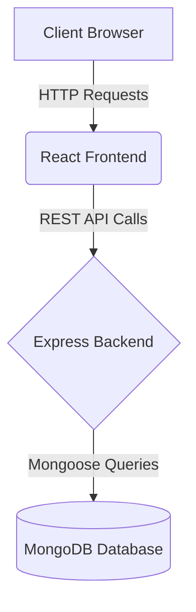

<div align="center">
  <h1>🩺 RuralCare</h1>
  <h3>Web-Based Telemedicine Platform for Rural Healthcare</h3>
  
  <p>
   
    
    
  </p>
</div>

<br/>

## 📌 Overview

**RuralCare** is a full-stack telemedicine platform designed to bridge the gap in healthcare accessibility for rural areas. 

The current implementation focuses on building a secure authentication system, scalable backend architecture, and functional frontend integration, forming a solid foundation for future modules like appointment booking and digital prescriptions.

---

## ✨ Features

### 🔐 Authentication Module
- **Patient Registration**: Secure user registration with `bcrypt` password hashing.
- **Secure Login**: Session management using JSON Web Tokens (JWT) authentication.
- **Role-Based Access**: Token generation tailored for different user roles.
- **Protected Routes**: Secure rendering of the user dashboard.
- **Data Storage**: Robust NoSQL user data management using MongoDB.

---

## 🛠 Tech Stack

| **Frontend**  | **Backend**     | **Database & Tools** |
| ------------- | --------------- | -------------------- |
| ⚛️ React.js | 🟢 Node.js      | 🍃 MongoDB Atlas   |
| 🎨 Vanilla CSS | 🚂 Express.js   | 🔑 JWT & bcrypt      |
| 🌐 Fetch API  |                 | 🔧 Git & GitHub      |

---

## 🏗 System Architecture



---

## 📂 Project Structure

```text
RuralCare/
├── backend/
│   ├── models/        # Mongoose database schemas
│   ├── controllers/   # Request handling logic
│   ├── routes/        # API route definitions
│   ├── middleware/    # Auth and error middleware
│   ├── server.js      # Main Express application entry point
│   └── package.json   # Backend dependencies
│
├── frontend/
│   ├── src/
│   │   ├── components/# Reusable React components
│   │   ├── services/  # API integration methods
│   │   ├── App.js     # Main React component
│   │   └── index.js   # React DOM rendering entry
│   ├── public/        # Static assets
│   └── package.json   # Frontend dependencies
│
└── README.md
```

---

## 🚀 Installation & Setup

### 1️⃣ Clone the Repository

```bash
git clone https://github.com/visi006/Rural_Care-.git
cd Rural_Care-
```

### 2️⃣ Environment Variables

Create a `.env` file inside the `backend/` directory and configure the following variables:

```env
MONGO_URI=your_mongodb_connection_string
JWT_SECRET=your_secret_key
PORT=5000
```

### 3️⃣ Backend Setup

Open a terminal and run the following commands to start the backend server:

```bash
cd backend
npm install
npm run dev
```

### 4️⃣ Frontend Setup

Open a new terminal session and run the following commands to launch the frontend development server:

```bash
cd frontend
npm install
npm start
```

---

## 📈 Future Enhancements

The platform is continuously evolving. Planned features include:
- 📅 **Appointment Booking System**: Schedule sessions with healthcare providers.
- 💬 **Chat-Based Consultation**: Real-time messaging between patients and doctors.
- 💊 **Digital Prescription Module**: Secure e-prescription generation and sharing.
- 📊 **Admin Dashboard**: Comprehensive monitoring and management interface.

---
> Made with ❤️ for improving rural healthcare accessibility. All contributions and suggestions are welcome!
